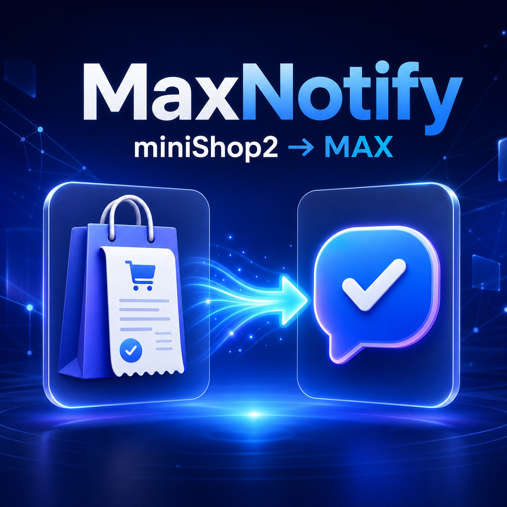

# MaxNotify для miniShop2

**MaxNotify** — компонент для MODX Revolution 2, который отправляет сведения
о заказах miniShop2 в мессенджер MAX через официальный
[MAX Business API](https://dev.max.ru/docs/maxbusiness/connection) или сервис
[rumaxbot.ru](https://rumaxbot.ru).

Компонент помогает владельцу и менеджерам интернет-магазина быстро узнавать
о новых заказах и изменениях их статуса без постоянной проверки панели MODX.

## Автор

- Разработчик: **Mishiko23**
- Email: **bigo2008@gmail.com**

## Возможности

- уведомление сразу после создания заказа miniShop2;
- уведомление при изменении статуса заказа;
- фильтрация уведомлений по ID статусов;
- номер, сумма и состав заказа;
- имя, телефон и email покупателя;
- адрес доставки и комментарий клиента;
- название способа доставки и оплаты;
- ссылка на конкретный заказ в панели MODX;
- официальный MAX Business API и сервис rumaxbot.ru на выбор;
- отправка одному или нескольким чатам, каналам или пользователям;
- сообщения в формате Markdown или HTML;
- редактируемые чанки сообщений;
- запись ошибок API и соединения в журнал MODX.

## Требования

- MODX Revolution 2.8+;
- miniShop2 2.x или 4.x;
- PHP 7.2+;
- PHP cURL или включённый `allow_url_fopen`;
- токен официального MAX-бота или канал и API-ключ rumaxbot.ru.

Компонент проверен с MODX Revolution 2.8.8-pl и miniShop2 4.4.2-pl.

## Установка

1. Откройте в MODX раздел **Пакеты → Установщик**.
2. Найдите компонент **MaxNotify** в репозитории
   [modstore.pro](https://modstore.pro).
3. Нажмите **Скачать**, затем **Установить**.
4. После установки очистите кэш MODX.

## Настройка

Откройте **Системные настройки** и выберите пространство имён `maxnotify`.

Основные параметры:

- `maxnotify.enabled` — включает или отключает компонент;
- `maxnotify.provider` — `rumaxbot` или `maxbusiness`;
- `maxnotify.format` — формат `markdown` или `html`;
- `maxnotify.timeout` — таймаут API-запроса в секундах;
- `maxnotify.notify_new_order` — уведомления о новых заказах;
- `maxnotify.notify_status_change` — уведомления о смене статуса;
- `maxnotify.statuses` — ID статусов через запятую, пустое поле разрешает все.

## Подключение официального MAX Business API

Официальное подключение доступно верифицированным организациям и ИП,
которые являются резидентами РФ.

1. Создайте и верифицируйте профиль на
   [платформе MAX для партнёров](https://business.max.ru).
2. Создайте чат-бота и дождитесь прохождения модерации.
3. Получите токен в разделе **Чат-боты → Перейти → Расширенные настройки →
   Настроить**.
4. Добавьте бота в нужный чат или канал либо запустите личный диалог с ботом.
5. Получите `chat_id` или `user_id` через Webhook/Long Polling API MAX.
6. Установите `maxnotify.provider` в значение `maxbusiness`.
7. Заполните настройки:
   - `maxnotify.max_token` — токен бота;
   - `maxnotify.max_ca_cert_path` — необязательный путь к PEM-файлу/CA bundle
     с сертификатом Минцифры;
   - `maxnotify.max_recipient_type` — `chat_id` или `user_id`;
   - `maxnotify.max_recipient_ids` — один или несколько ID через запятую;
   - `maxnotify.max_notify` — уведомлять участников чата;
   - `maxnotify.max_disable_link_preview` — отключить превью ссылок.

Официальный API принимает сообщения длиной до 4000 символов. Более длинные
уведомления MaxNotify автоматически сокращает.

С 19 июля 2026 MAX требует отправлять запросы на домен
`platform-api2.max.ru` вместо `platform-api.max.ru` и добавить сертификат
Минцифры в список доверенных. В MaxNotify новый домен используется по
умолчанию. Если на сервере PHP/cURL не доверяет сертификату системно,
укажите путь к PEM-файлу или CA bundle в настройке
`maxnotify.max_ca_cert_path`.

## Подключение rumaxbot.ru

Установите `maxnotify.provider` в значение `rumaxbot`, затем укажите:

- `maxnotify.api_key` — API-ключ канала rumaxbot.ru;
- `maxnotify.api_url` — адрес API отправки сообщений;

1. Зарегистрируйтесь на rumaxbot.ru и подтвердите email.
2. Создайте канал.
3. Подключите MAX-бота к каналу по инструкции сервиса.
4. Создайте API-ключ канала.
5. Укажите ключ в настройке `maxnotify.api_key`.

API-ключ нельзя публиковать или добавлять в репозиторий.

## Шаблоны сообщений

После установки в категории элементов `MaxNotify` будут созданы чанки:

- `maxNotifyOrderCreated` — новый заказ в Markdown;
- `maxNotifyOrderStatus` — новый статус в Markdown;
- `maxNotifyOrderCreatedHtml` — новый заказ в HTML;
- `maxNotifyOrderStatusHtml` — новый статус в HTML.

Доступные плейсхолдеры: `num`, `cost`, `receiver`, `phone`, `email`,
`address`, `comment`, `order_comment`, `products`, `delivery_name`,
`payment_name`, `status_name`, `manager_url` и другие поля заказа.
